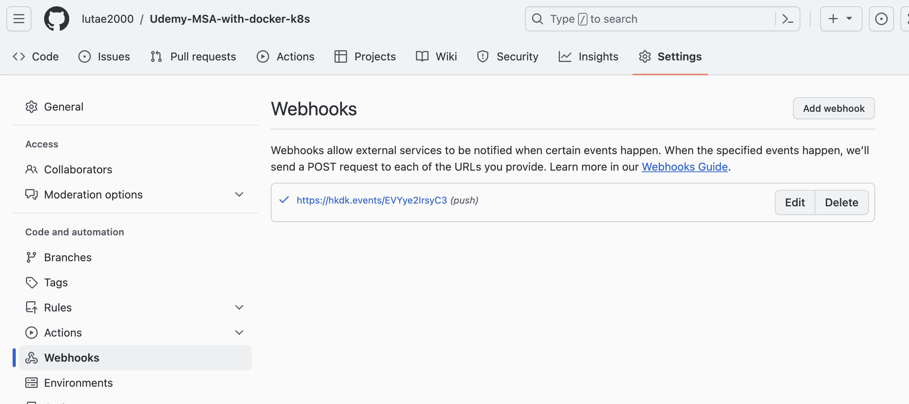

# Udemy-MSA-with-docker-k8s
Spring Boot, Spring Cloud, Docker, Kubernetes, Helm, 마이크로서비스 보안을 통해 마이크로서비스 학습 및 개발

#### [Udemy 강의 링크]
https://ssginc.udemy.com/course/master-microservices-with-spring-docker-kubernetes

#### [Dockerfile vs Buildpack vs Jib(Java만 가능)](https://medium.com/spring-boot/speed-up-and-downsize-spring-boot-built-image-from-dockerfile-to-buildpack-to-jib-aad0674643ee)

#### [Dockerfile vs Buildpack vs Jib 한글참조 문서](https://blog.leaphop.co.kr/blogs/32)


##### JIB 빌드 명령어(Gradle 기준, 빌드 할 Repository 상위에서 실행)
```
./gradlew jib
```

##### Docker compose 실행시 명령어
```
docker compose up -d
```

<hr>

#### [Spring Cloud Config]
- yml 파일에 있는 설정을 Spring cloud config 서버를 이용할시 서비스 재배포가 필요없음 
- 참조문서: https://docs.spring.io/spring-cloud-config/docs/current/reference/html/

마이크로서비스의 재빌드 없이 아래의 HTTP 호출로 config 서버로부터 받아온 설정으로 재기동 할 수 있음
- rabbitMQ와 spring config server 같이 이용시 yml 적용 가능
- POST: [도메인]/refresh


웹훅을 이용하여 push 될때 자동으로 refresh 되게도 가능
로컬호스트 테스트를 위해 hookdeck.com 이용(무료)
운영상태에서는 git webhook => 젠킨스 트리거 이용하면 될듯 함




<hr/>

#### [Spring Cloud Gateway]

마이크로서비스의 게이트웨이 & 로드밸런싱 역할을 담당
Spring Cloud Native 모델상 각 서비스는 직접 통신하는게 아닌 Gateway를 통해 통신
예시: 포인트 repo => mber 레포 통신시 순서
point > gateway > mber

- 참조문서: https://docs.spring.io/spring-cloud-gateway/docs/current/reference/html/


#### [MSA Resilient 패턴]
##### resilience4j - circuit Breaker
API가 특정한도이상 초과하여 통신이 불가할 경우 circuit breaker를 오픈하여 트래픽 차단

##### resilience4j - retry
에러발생하였을때 특정 서비스로 backoff 하여 응답처리 할수 있음

##### resilience4j - ratelimiter
API통신 빈도수 제한을 통해 응답처리 가능

#### Grafana Loki 로깅에서 traceId로 Tempo 서비스에서 검색시 각 서비스의 응답시간에 대해 확인 가능
아래 사진은 G/W -> accounts -> loans 순으로 데이터 조회 요청


